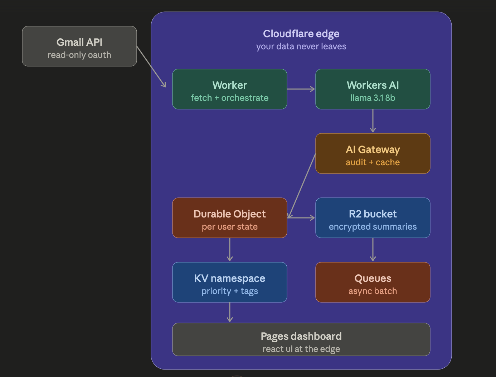

# VaultMail

Privacy-first AI email triage. Your inbox never leaves Cloudflare's edge.

**Live:** https://vaultmail.manshupallav.workers.dev

## What it does

Connects to your Gmail (read-only), uses AI to triage your emails — priority, category, summary, suggested action — without sending a single byte to OpenAI, Anthropic, or Google AI.

## Why it exists

Every existing AI email assistant requires giving a third-party AI vendor full inbox access. For lawyers, doctors, founders, journalists — anyone with privileged information — that's a non-starter. VaultMail is the third option.

## How it works

The entire AI pipeline runs on Cloudflare's edge:

- **Workers AI** runs Llama 3.1 8B for triage at the edge
- **AI Gateway** logs every AI call as a verifiable audit trail
- **R2** stores AES-GCM-256 encrypted summaries
- **KV** holds OAuth tokens and email metadata
- **Durable Objects** serialize per-user syncs

The email body is processed in-memory inside a Worker and discarded. No external AI vendor ever sees your inbox.

**Live:** https://vaultmail.manshupallav.workers.dev

## Privacy guarantees

- No email body is ever sent to any third-party AI provider
- All inference runs on Cloudflare Workers AI at the edge
- AI Gateway logs every call — verifiable audit trail
- Summaries encrypted with AES-GCM-256 before R2 write
- OAuth scope: `gmail.readonly` only — VaultMail cannot send, modify, or delete email
- Source code is open. Verify the boundary yourself.

## Run it yourself

See [SETUP.md](./SETUP.md) for the development setup.